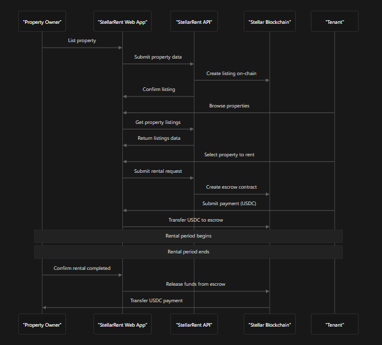

# StellarRent

## Empowering Global Rentals

Traditional rental platforms like Airbnb and real estate agencies impose high fees (7%-20%), slow payment processing (1-7 days), and lack transparency, often excluding small property owners and tenants in emerging markets. StellarRent aims to solve this by providing a decentralized, peer-to-peer (P2P) rental platform built on the Stellar blockchain, enabling secure, transparent, and cost-efficient rentals for everyone.

We believe that **everyone** deserves access to a fair rental marketplace with **minimal fees**, **instant payments**, and **complete transparency**, powered by blockchain technology.

Leveraging Stellar's fast transactions (3-5 seconds), near-zero fees (~$0.000001), and Soroban smart contracts, StellarRent abstracts the complexity of blockchain into a user-friendly experience for property owners and tenants worldwide.

## Partners

<table>
  <tr>
    <td width="100" align="center"></td>
    <td width="800">Proudly built on the <a href="https://www.stellar.org/">Stellar blockchain</a>, leveraging its fast, low-cost transactions and Soroban smart contracts.</td>
  </tr>
  <tr>
    <td width="100" align="center"></td>
    <td width="800">Developed with the <a href="./assets/stellarlogo.svg">OnlyDust community</a>. We're looking for contributors—join us!</td>
  </tr>
</table>

## Codebase

This monorepo contains the full stack for StellarRent, including the frontend, backend, and smart contracts.

### Core Architecture Design

StellarRent connects property owners and tenants through a decentralized platform on Stellar. Owners list properties via a Soroban smart contract, tenants pay with USDC, and payments are secured in an escrow contract until the rental conditions are met. All transactions are recorded on Stellar's public ledger for transparency.

### Core Operations

_Sequence diagram showcasing how the core operations (list property, rent property, confirm rental, and payment escrow) are handled._

### Current Development State

StellarRent is under active development. Contributions are welcome!

We are currently building a minimal prototype, focusing on the essential features:

- Listing properties on Testnet using Soroban smart contracts.
- Renting properties with USDC payments.
- Securing payments with a basic escrow system.

The project uses:

- **Frontend**: Next.js with Tailwind CSS for a user-friendly interface.
- **Backend**: Node.js/Express with Supabase for user authentication and data management.
- **Smart Contracts**: Soroban on Stellar for decentralized rental logic.

## Try It Out

A quick tutorial on how to run the project locally is available in [USAGE.md](./USAGE.md).

## Contributing

We welcome contributions from the community! Please check out our open issues on GitHub or OnlyDust to find tasks that interest you.

Helpful information for contributors is available in [CONTRIBUTING.md](./CONTRIBUTING.md).

We are also registered on [OnlyDust](https://app.onlydust.com/projects/stellarrent).

## Contact

Feel free to reach out via our community telegram:

- [Telegram](https://t.me/stellarentdevs)

---

Let's build a fairer, more efficient rental ecosystem together—powered by Stellar! 🌟

👉 **[Visit the StellarRent GitBook Now!](https://stellar-rent.gitbook.io/stellar-rent)**

---

## **Thanks to all the contributors who have made this project possible!**

